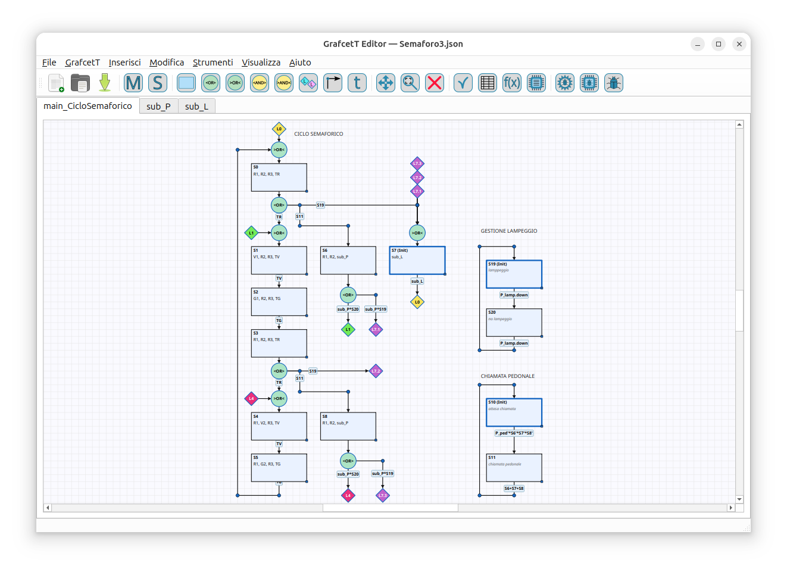

# GrafcetT Editor

**GrafcetT Editor** è un ambiente grafico per la modellazione di un sistema sequenziale con successione di stati e transizioni condizionate.
Produce software C++ per microcontrollori con `#include <GrafcetT.h>`. È necessario che nell'IDE di compilazione sia stata caricata la libreria **GrafcetT**.

